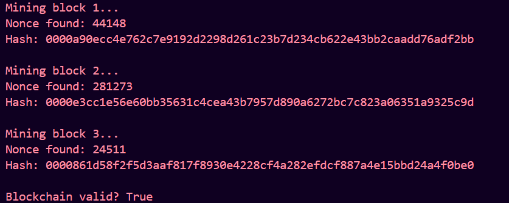

# Simple Proof of Work Blockchain

## Overview
This project demonstrates a minimal blockchain simulation using Proof of Work.

## Features
- Block creation
- SHA-256 hashing
- Proof of Work mining
- Blockchain validation

## How Blocks Are Created
Each block contains:
- Index
- Timestamp
- Data
- Previous Hash
- Nonce
- Current Hash

## How Hashing Works
SHA-256 generates a unique hash:

Hash = SHA256(data + previousHash + timestamp + nonce)

## Proof of Work
Mining changes nonce until hash starts with:

0000

## Purpose of Nonce
Nonce is changed repeatedly until a valid hash is found.

## Validation
The chain is checked for:
- Correct hashes
- Valid previous hash links
- Proof of Work satisfaction

## Why Difficulty Increases Mining Time
Higher difficulty means more leading zeros required, making mining harder.

## Run Project

```bash
python blockchain.py
```

## Sample Output
